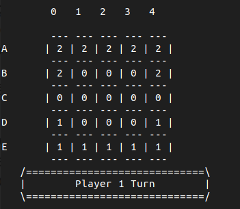

# Five Field Kono

## Five Field Kono_1

| Member                             | Number      | Contribution |
| ---------------------------------- | ----------- | ------------ |
| Carolina Cintra Fernandes Figueira | up201906845 | 50%          |
| Tiago Peixoto Barreto Rodrigues    | up201907021 | 50%          |

# Installation and Execution

The game does not have any special compilation requirements and should run in any environment where SICStus Prolog is properly installed. The 4.7.0 version was used, and interoperability with other versions is not guaranteed.

One system requirement is having a font with all ASCII characters, but since that is the norm, it shouldn't be a problem.

To run the game on a graphical interface:

1. Open SICStus Prolog
2. Open `File` > `Consult` > `Select kono.pl located in directory /src of this project`

And if running the game on a terminal:

1. Open the SICStus Prolog REPL on the project folder
2. Type the following:

```prolog

consult('./src/kono.pl').

```

After this, in both cases, the game should start running the command:

```prolog
play.
```

# Game description

## Introduction

Five Field Kono is a Korean 2-player abstract strategy game. It was first recorded in 1895, by ethnographer Stewart Culin. Like in Chinese checkers, the objective of the game is to move all of one's pieces to the other side of the board, in the starting configuration. The players, at each turn, can move only one piece one square at a time in a diagonal fashion, either forwards or backwards, occupying a vacant position. The first player to occupy all the places left by his opponent at the start of the game, wins the game.

## Preparing the game

The starting board is a 5x5 square grid. Each player has 7 pieces, placed along the nearest border. A starting configuration will look like this:


## Rules

The rules of the game are simple. As stated before, only diagonal moves are valid, and these can be performed either forward or backwards. At most, a piece will have 4 available moves. The pieces cannot jump over any other piece, and there is no capturing of pieces.

If at any point there are no moves available to any player, a draw occurs.

A game is won when all the players pieces occupy the places vacated by the opponent, in the starting configuration.

For a more information about the origin and rules of the game, the bibliography section includes relevant links to gain a better understanding of Five Field Kono

## Game Logic

To create this game using Prolog, we chose the MVC design pattern. Having an understanding of the different components that constitute this project, we believe that separating Model, Controller and View is a good strategy. For a better comprehension of how these design model was implemented, the following are the most relevant topics:

### Game state Representation

The representation of the board is made through a list of lists, in which each individual list represents a row, and a certain index in all rows represents a column. Each position of the board is either empty ("0") or filled with one, and just one, piece from a player ("1" for Player 1 and "2" for Player 2). Since the pieces can only move to other positions and never leave the board (there is no capturing), there are always 7 pieces from each player on the board and the rest of the areas are empty.

Our game does not require any other form of representation (e.g. pit with captured pieces), since the whole process of playing the game happens on the board.

### Game state visualization

Before the game starts, the main menu is printed on the console. By choosing an option, different views for particular game settings will appear. In every menu, the functions that deal with the selected option have an implementation for invalid inputs. e.g. In the starting menu, to choose a specific game setting, the user must input 1, 2 or 3; any other input will be considered invalid and an error message will be printed on the console.

After the game starts, the interface is filled with the visual representation of the board, which includes the actual 5X5 board, the symbols that illustrate rows (A-E) and columns (0-4), and a box with information of who's turn is it.

Below is a representation of the initial state of the board.



### Move execution

To perform the action of moving a piece, inputs for row, column and direction are required and validated given the current state of the board. In order to validate a move in Kono, not only must the position chosen be occupied by a player's piece, the direction must indicate to a valid and empty spot in the board. After validation, the play is executed and the board is modified with the new setting. To ensure this execution, we created the predicate move(+Board, +Player, +Move, -Board).

### End Game

Checking if the game is over is very simple - either one of the players has all of their pieces on the opponent's starting positions or both of them do, and that means it's a tie. In order to identify this situation, a function is responsible for comparing the current board to the two settings that indicate the end of the game. When it is over, the game flow is interrupted and a winner is declared. The predicate for this section was implemented as sugested: game_over(+Board, -Result).

### List of Valid Moves

To get all valid moves, the only important point regarding game rules is that players can only move into the empty spots on the board. Besides this point, the validation must consider the board limits. Our predicate valid_moves(+Board, +Player, -Moves) includes the information about the player, in order to check all valid moves after locating the correct pieces and evaluating the spots diagonally to it.

### Evaluating the game's state

Since Five Field Kono doesn't include point acumulation or capturing pieces from the opponent, it is hard to define a value for each player at any given moment that isn't the end of the game. Knowing that, the concept of game state evaluation on a normal Player vs Player game wasn't implemented, but the game state is taken under consideration for the greedy algorithm. In order to make good inclusions of possible moves for a certain player, it is important to know if an opponent's piece would be blocked in its starting position. Since our AI approach is offensive, in that situation the bot would try to move forward again but would be stopped by the opponent's piece. To prevent that, the play is simulated and the resulting board is evaluated before including said move in the list of good moves. The sugested predicate for this section was not implemented.

### Choosing the computer's move

Two different bots were implemented to play against a human player, or another bot. The easy one doesn't have any criterion for choosing its next move; the hard one will always try to choose a random move from a list of greedy ones - moves that go forward on the board, and don't block an opponent's piece in a starting position. In order to do that, the direction of each possible move is analysed and when the piece is in the middle of the board, a simulation of the play is done to prevent unwanted blocking. The predicate created was choose_move(+GameState, +Player, +Level, -Move), that has information about the player to guarantee that in the greedy approach Player1 moves up and Player2 moves down.

## Conclusion

### Final remarks

The project accomplishes all that was proposed to complete, and all features work as intended. Even greater than that, it helped to massively improve the understanding of the Prolog language, and to understand the use cases and utility of a programming paradigm like logical programming in the context of game development.

### Known issues

Whilst we consider the project satisfactory, there are some issues that could be addressed. For one, there is some unnecessary code repetition, as time constraints didn't allow enough time to refactor this. Secondly, a medium difficulty could have been implemented, which would allow for even more levels of play. Finally, the hard bot could have been developed with a more complex strategy, which included more scenarios and game factors but once again due to time constraints it was decided to stick to a simpler version, with a strategy that appears to function sufficiently well.

### Roadmap

For a future development this game could be made with a more complex bot, taking into account more factors and maybe even using artificial intelligence. Also, a refactor to remove the repeated code was at hand, and finally a worthy long-term improvement is to make the game distributed, allowing players in different computers to challenge each other, leading to an even better game experience.


## Bibliography

- [Bead Game's Description](https://bead.game/games/traditional/five-field-kono)
- [What do we do all day's article](https://www.whatdowedoallday.com/five-field-kono/)
- [A small article from the university of Lisbon](https://www.di.fc.ul.pt/~jpn/gv/kono.htm)
- [Board and Table Games from Many Civilizations, 2nd ed (p98)](https://ia801606.us.archive.org/33/items/B-001-002-771/B-001-002-771.pdf)

**Comment the game please**
**Screenshots can be included**
