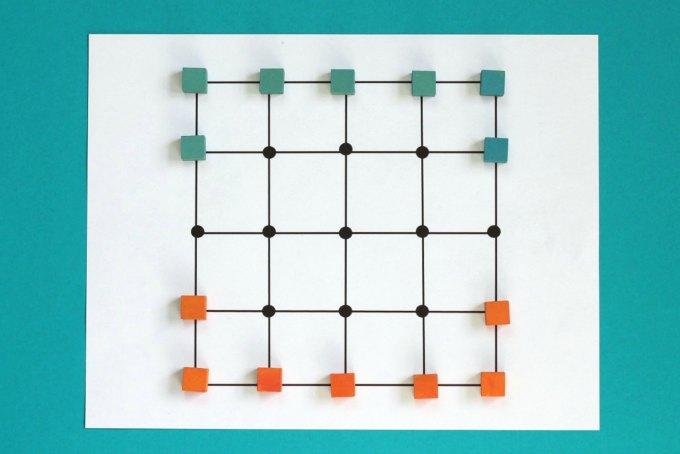

# Five Field Kono

---

## Five Field Kono_1

| Member                             | Number      | Contribution |
| ---------------------------------- | ----------- | ------------ |
| Carolina Cintra Fernandes Figueira | up201906845 | 50%          |
| Tiago Peixoto Barreto Rodrigues    | up201907021 | 50%          |

# Installation and Execution

The game does not have any special compilation requirements and should run in any environment where SICStus Prolog is properly installed. The 4.7.0 version was used, and interoperability with other versions is not guaranteed.

One system requirement is having a font with all ASCII characters, but since that is the norm, it shouldn't be a problem.

To run the game on a graphical interface:

1. Open SICStus Prolog
2. Open `File` > `Consult` > `Select kono.pl located in directory /src of this project`

And if running the game on a terminal:

1. Open the SICStus Prolog REPL on the project folder
2. Type the following:

```prolog

consult('./src/kono.pl').

```

After this, in both cases, the game should start running the command:

```prolog
play.
```

# Game description

## Introduction

Five Field Kono is a Korean 2-player abstract strategy game. It was first recorded in 1895, by ethnographer Stewart Culin. Like in Chinese checkers, the objective of the game is to move all of one's pieces to the other side of the board, in the starting configuration. The players, at each turn, can move only one piece one square at a time in a diagonal fashion, either forwards or backwards, occupying a vacant position. The first player to occupy all the places left by his opponent at the start of the game, wins the game.

## Preparing the game

The starting board is a 5x5 square grid. Each player has 7 pieces, placed along the nearest border. A starting configuration will look like this:



## Rules

The rules of the game are simple. As stated before, only diagonal moves are valid, and these can be performed either forward or backwards. At most, a piece will have 4 available moves. The pieces cannot jump over any other piece, and there is no capturing of pieces.

If at any point there are no moves available to any player, a draw occurs.

A game is won when all the players pieces occupy the places vacated by the opponent, in the starting configuration.

## Bibliography

- [Bead Game's Description](https://bead.game/games/traditional/five-field-kono)
- [What do we do all day's article](https://www.whatdowedoallday.com/five-field-kono/)
- [A small article from the university of Lisbon](https://www.di.fc.ul.pt/~jpn/gv/kono.htm)
- [Board and Table Games from Many Civilizations, 2nd ed (p98)](https://ia801606.us.archive.org/33/items/B-001-002-771/B-001-002-771.pdf)

# Game Logic - implement play/0 as starting move (2400 words)

## Representation of the internal state of the game

## Visualization of the game - predicate display_game(+GameState) used for display

## Move execution - predicate move(+GameState, +Move, -NewGameState) should be used

## End Game - predicate game_over(+GameState, -Winner) should be used

## List of Valid Moves - predicate valid_moves(+GameState, -ListOfMoves) is the one to choose.

## Evaluating the game's state (OPTIONAL) - use the predicate value(+GameState, +Player, -Value)

## Choosing the computer's move - Have a difficulty level attributed (OPTIONAL HAVING MORE THAN ONE LEVEL), using the predicate choose_move(+GameState, +Level, -Move)

# Conclusion (250 words)

## Final remarks

### Positives

### Known issues

## Roadmap

# Bibliography - Books, articles and other web resources used for developing the work.

**Comment the game please**
**Screenshots can be included**
